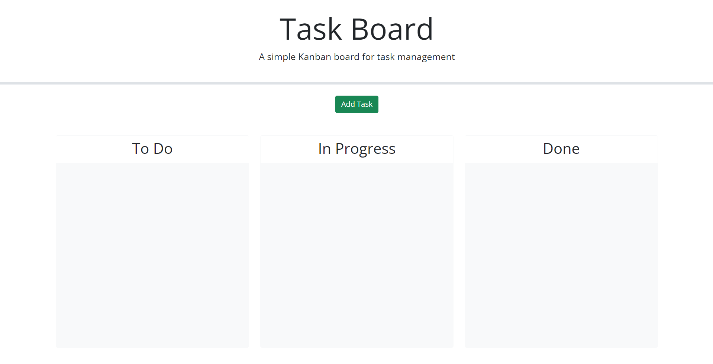
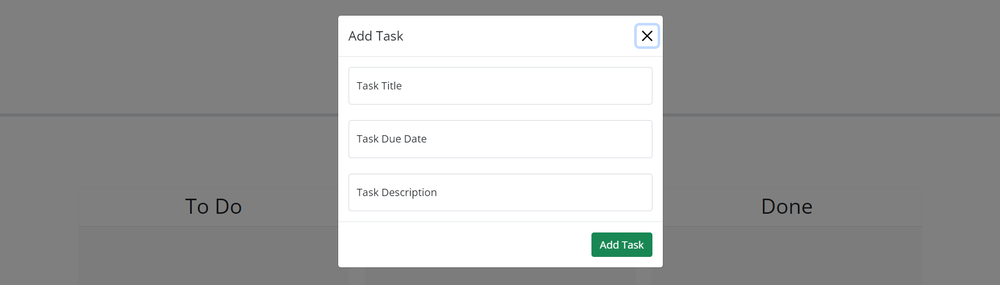
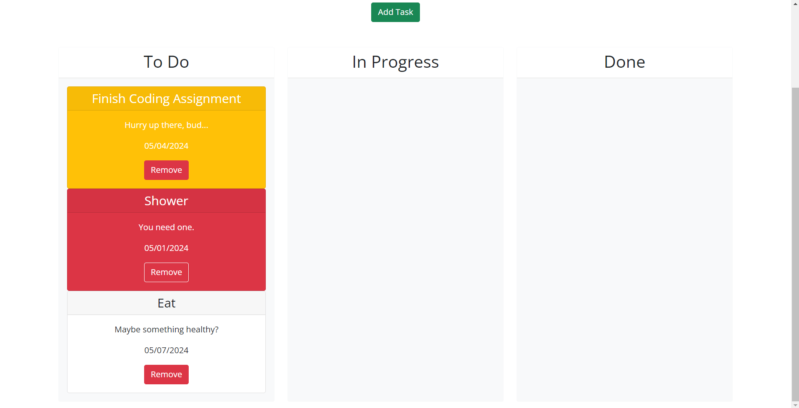
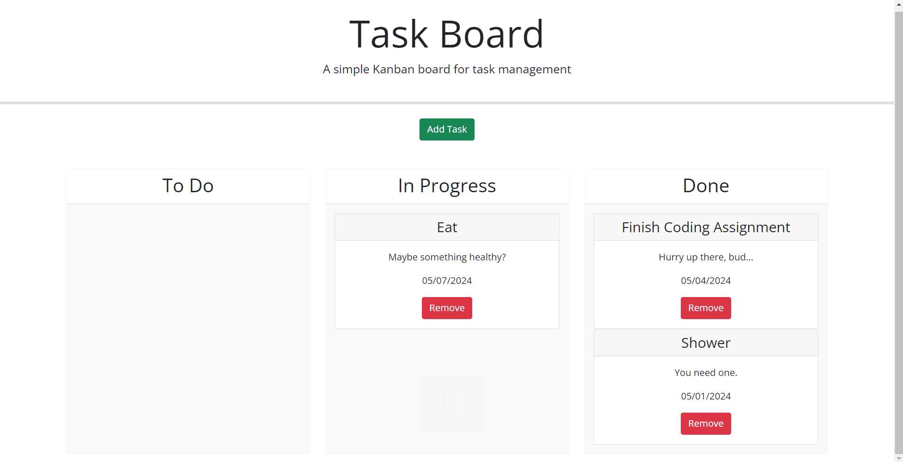

# Task-Board

## Description

This webpage is designed to give the user a task board where they can add individual tasks, manage the state of progress for those tasks, and track overall project progress accordingly. The development of this webpage required the implementation of many different features, some of which took much longer than expected to understand and execute, but it helped to expand my experience in debugging and figuring out how to make the code function properly. 

## Usage

To open the Task Board, click this link here to go directly!

[Task Board Webpage](https://geovko.github.io/Task-Board/)

*OR* Copy this link to paste it into a browser.
  ```md
https://geovko.github.io/Task-Board/
  ```

The task board will have an 'Add Task' button (green button) as well as three columns labeled 'To Do', 'In Progress', and 'Done'. 



Clicking the 'Add Task' button will open a modal which will allow the user to input 'Task Title', 'Task Due Date', and 'Task Description'.



Once the 'Add Task' button on the modal is clicked, a task card will be formed in the 'To Do' column. (If any of the inputs are left blank, the user will be alerted to fill in that particular input.) Below, there are three different tasks included in the 'To-Do' column. Each color reflects the task due date with respect to the current date. Red indicates the due date has already passed. Yellow indicates the due date is the same as the current date. White indicates the due date has not passed yet.



The created tasks can be clicked and dragged across the webpage where it can be dropped into any of the columns. Once a task is dropped into the 'Done' column, the task will turn white.



Included in each task card is a 'Remove' button (red button). Once clicked the target card will be removed from the column.

The created tasks are stored in local storage. As such, even if the user refreshes the page, the created tasks (that weren't deleted) will continue to be displayed on the webpage.

## Credits

This project wouldn't have been completed without the aid of tutorials and assignments provided by the UCI Bootcamp teaching staff. The starter code which this code began from was graciously provided by mcewball13 through Github. 

## License

MIT License
